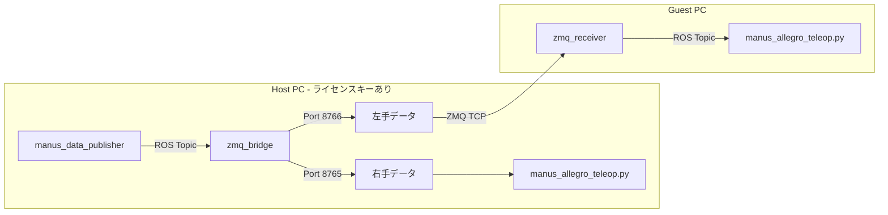
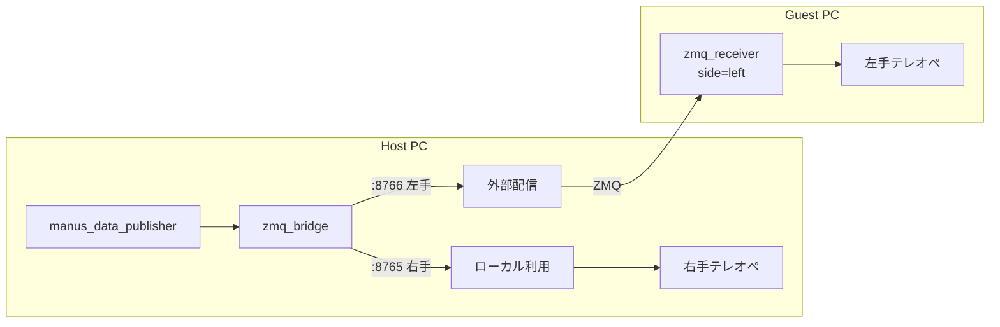
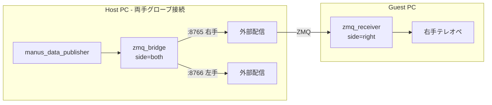
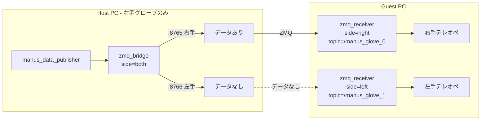
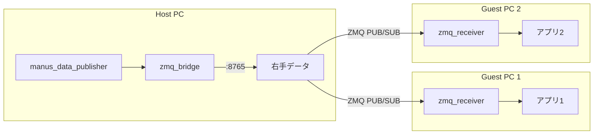

# manus_ros2_transporter

ROS通信を使わずにManus GloveのデータをPC間で転送するためのZeroMQベースのトランスポーターパッケージ。

## 概要

このパッケージは、`ROS_AUTOMATIC_DISCOVERY_RANGE=LOCALHOST` 設定下で、異なるPC間でManus Gloveデータを共有するために設計されている。
たとえばライセンスキーが1つしかなく、異なるPC間でそれぞれManus Gloveを用いたいときのために用いることを想定している。

## 前提条件

**重要**: このパッケージを使用する前に、MANUS公式の `manus_ros2` パッケージをインストールしておく必要がある。

- **MANUS ROS2 パッケージ**: https://docs.manus-meta.com/3.1.0/Plugins/SDK/ROS2/getting%20started/

上記ドキュメントに従い、MANUS SDKとROS2パッケージをセットアップしておくこと。

## アーキテクチャ



## 初期設定

### 1. グローブIDの確認

グローブの電源を入れて `manus_data_publisher` を起動すると、ログにグローブIDが表示される：

```bash
ros2 run manus_ros2 manus_data_publisher
```

出力例：
```
[2024-12-29 17:30:00.123] [info] Glove ID 0x423A35C7: Detected right hand
Glove ID 1111111111: Detected right hand, applying coordinate transformations:
  Step 1: Y-axis mirroring for right hand
  Step 2: Frame rotation (X→-Y, Y→X, Z→Z)
```

**重要**: 
- `0x423A35C7` は16進数表記、10進数表記では`1111111111`に該当。
- 設定ファイルでは16進数（`"0x..."`）または10進数で記述できる
- 変換例: `0x423A35C7` → `1111111111`

### 2. IPアドレスの確認

**ホストPC（サーバー側）のIPアドレスを確認:**
```bash
# Linux
ip a
# または
hostname -I
```

出力例：
```
192.168.1.100
```

**ゲストPCからの疎通確認:**
```bash
# From guest
ping 192.168.1.100
```

### 3. 設定ファイルの編集

`config/manus_devices.yaml` を編集して、グローブIDを登録：

```yaml
# 既知のデバイス
devices:
  # 右手グローブ（例: 0x423A35C7 または 1111111111）
  - glove_id: 1111111111
    side: right
    port: 8765
    alias: "my_right_glove"
    
  # 左手グローブ（例: 0x84742D2E または 2222222222）
  - glove_id: 2222222222
    side: left
    port: 8766
    alias: "my_left_glove"

# サーバー設定
server:
  bind_address: "0.0.0.0"  # 全インターフェースでリッスン
  default_right_port: 8765
  default_left_port: 8766

# 自動検出（未登録グローブも自動的に処理）
auto_discovery:
  enabled: true
  assign_port_by_side: true
```

### 4. ファイアウォール設定

ホストPCでZMQポートを開放：
```bash
sudo ufw allow 8765/tcp
sudo ufw allow 8766/tcp
```

### 5. 16進数 → 10進数変換ツール

Pythonで変換できます：
```python
# 16進数 → 符号付き10進数
>>> import numpy as np
>>> np.int32(0x423A35C7)
1111111111

# 10進数 → 16進数
>>> hex(1111111111 & 0xFFFFFFFF)
'0x423A35C7'
```

---

## クイックスタート

### ホストPC（推奨: ワンコマンド起動）

```bash
# manus_data_publisher と zmq_bridge を同時に起動（推奨）
ros2 launch manus_ros2_transporter manus_bridge.launch.py

# 右手のみ配信する場合
ros2 launch manus_ros2_transporter manus_bridge.launch.py side:=right
```

### ゲストPC

```bash
# 左手データを受信（ホストIPを指定）
ros2 run manus_ros2_transporter zmq_receiver \
  --ros-args -p side:=left -p server_ip:=192.168.1.100
```

---

## ユースケース

### ケース1: ホスト=右手、ゲスト=左手（基本構成）

最も一般的な構成。ホストPCで右手グローブを使用し、ゲストPCで左手グローブを使用。



**ホストPC:**
```bash
# 推奨: launchファイルで一括起動
ros2 launch manus_ros2_transporter manus_bridge.launch.py

# または個別起動
ros2 run manus_ros2 manus_data_publisher
ros2 run manus_ros2_transporter zmq_bridge  # side=both (デフォルト)
```

**ゲストPC:**
```bash
ros2 run manus_ros2_transporter zmq_receiver \
  --ros-args -p side:=left -p server_ip:=<ホストIP>
```

---

### ケース2: ホスト=両手、ゲスト=右手のみ受信

ホストPCで両手グローブを接続し、ゲストPCは右手データのみを受信。



**ホストPC:**
```bash
ros2 launch manus_ros2_transporter manus_bridge.launch.py
```

**ゲストPC:**
```bash
ros2 run manus_ros2_transporter zmq_receiver \
  --ros-args -p side:=right -p server_ip:=<ホストIP>
```

---

### ケース3: ホスト=右手のみ、ゲスト=両手使用

ホストPCに右手グローブのみ接続されている状態で、ゲストPCが両手のデータを必要とする場合。

**重要**: ゲストが両手を使いたい場合、ホスト側は `side=both` で起動する必要がある（集合論的に `ゲストの要求 ⊆ ホストの配信` の関係となるため）。



**ホストPC:**
```bash
ros2 launch manus_ros2_transporter manus_bridge.launch.py
```

**ゲストPC (2つのレシーバーを起動):**
```bash
# 右手用レシーバー
ros2 run manus_ros2_transporter zmq_receiver \
  --ros-args -p side:=right -p server_ip:=<ホストIP> -p topic:=/manus_glove_0

# 左手用レシーバー（別ターミナル）
ros2 run manus_ros2_transporter zmq_receiver \
  --ros-args -p side:=left -p server_ip:=<ホストIP> -p topic:=/manus_glove_1
```

**注意**: この構成では、左手グローブが接続されていない場合、左手用レシーバーはデータを受信しない。

---

### ケース4: 1つのグローブを複数PCで共有

同じグローブデータを複数のゲストPCで受信したい場合（デモ・モニタリング用途など）。



ZMQ PUB/SUBパターンにより、複数のサブスクライバーが同時に接続可能。

---

## インストール

### 前提条件

1. MANUS ROS2 パッケージのインストール
   
   [MANUS公式ドキュメント](https://docs.manus-meta.com/3.1.0/Plugins/SDK/ROS2/getting%20started/) に従い、`manus_ros2` パッケージをインストールしておくこと。

2. Python依存パッケージ

  `uv`を用いた仮想環境の利用を推奨。

   ```bash
   pip install pyzmq pyyaml numpy
   ```

### ビルド

```bash
cd ~/colcon_ws
colcon build --symlink-install --packages-select manus_ros2_transporter
source install/setup.bash
```

## 設定ファイル

### config/manus_devices.yaml

```yaml
# 既知のデバイス
devices:
  - glove_id: 1111111111  # 右手グローブ (0x423A35C7)
    side: right
    port: 8765
    alias: "right_glove"
    
  - glove_id: 2222222222   # 左手グローブ (0x84742D2E)
    side: left
    port: 8766
    alias: "left_glove"

# サーバー設定
server:
  bind_address: "0.0.0.0"
  default_right_port: 8765
  default_left_port: 8766

# 自動検出
auto_discovery:
  enabled: true
  assign_port_by_side: true
```

## Launch ファイル

### `manus_bridge.launch.py`（推奨）

`manus_data_publisher` と `zmq_bridge` を同時に起動。

```bash
# デフォルト（両手配信）
ros2 launch manus_ros2_transporter manus_bridge.launch.py

# 右手のみ
ros2 launch manus_ros2_transporter manus_bridge.launch.py side:=right

# カスタムポート
ros2 launch manus_ros2_transporter manus_bridge.launch.py right_port:=9000 left_port:=9001
```

### `bridge.launch.py`

`zmq_bridge` のみを起動（`manus_data_publisher` は別途起動済みの場合）。

### `receiver.launch.py`

`zmq_receiver` を起動（ゲストPC用）。

```bash
ros2 launch manus_ros2_transporter receiver.launch.py \
  server_ip:=192.168.1.100 side:=left
```

## パラメータ

### `zmq_bridge`

| パラメータ | デフォルト | 説明 |
|-----------|-----------|------|
| `side` | `both` | 配信する手: `left`, `right`, `both` |
| `right_port` | `8765` | 右手データ用ポート |
| `left_port` | `8766` | 左手データ用ポート |
| `bind_address` | `0.0.0.0` | バインドアドレス |
| `config_path` | `""` | 設定ファイルパス（オプション） |

### `zmq_receiver`

| パラメータ | デフォルト | 説明 |
|-----------|-----------|------|
| `side` | `left` | 受信する手: `left`, `right` |
| `server_ip` | `127.0.0.1` | サーバーIPアドレス |
| `port` | `0` | ポート（0=side に基づいて自動選択） |
| `topic` | `/manus_glove_0` | パブリッシュ先トピック |
| `reconnect_interval` | `1.0` | 再接続間隔（秒） |

## トラブルシューティング

### 接続できない

1. **ファイアウォール確認**
   ```bash
   # ポート 8765, 8766 を開放
   sudo ufw allow 8765/tcp
   sudo ufw allow 8766/tcp
   ```

2. **ネットワーク疎通確認**
   ```bash
   ping <サーバーIP>
   ```

3. **サーバー側のログ確認**
   ```bash
   ros2 launch manus_ros2_transporter manus_bridge.launch.py
   # "ZMQ PUB socket bound" が表示されることを確認
   ```

### データが来ない

1. **manus_data_publisher が動作しているか確認**
   ```bash
   ros2 topic list | grep manus
   ros2 topic echo /manus_glove_0
   ```

2. **グローブの電源が入っているか確認**

3. **side パラメータが正しいか確認**

### グローブIDがわからない

1. ホストPCで `manus_data_publisher` を起動
2. グローブの電源を入れる
3. ログに表示される `Glove ID 0x...` を確認
4. 16進数を10進数に変換して設定ファイルに記入

## 参考リンク

- [MANUS ROS2 公式ドキュメント](https://docs.manus-meta.com/3.1.0/Plugins/SDK/ROS2/getting%20started/)

