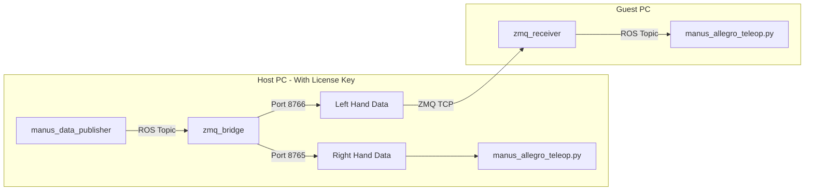
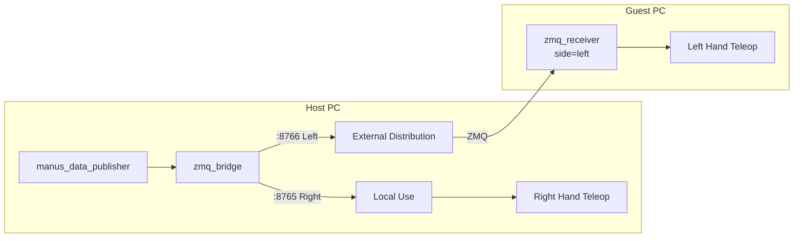
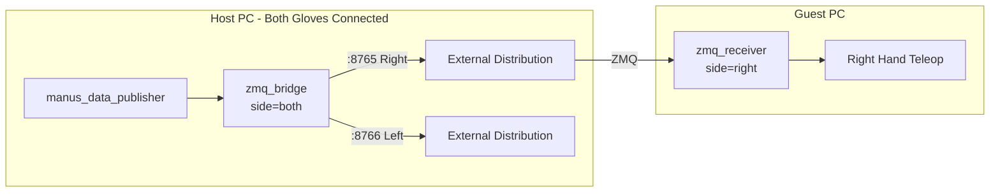
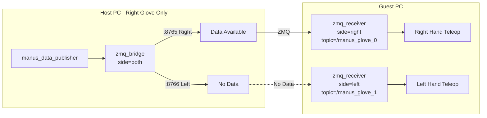
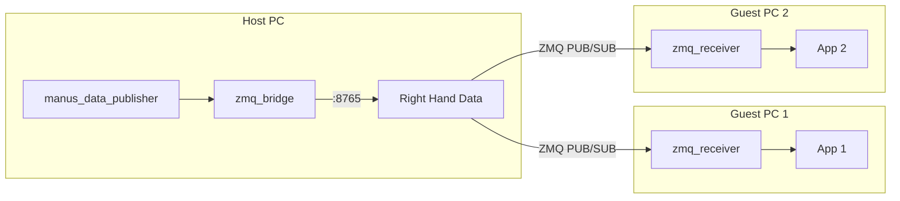

# manus_ros2_transporter

※ [日本語版のREADMEはこちら](README.ja.md)

A ZeroMQ-based transporter package for transferring Manus Glove data between PCs without ROS networking.

## Overview

This package is designed to share Manus Glove data between different PCs under `ROS_AUTOMATIC_DISCOVERY_RANGE=LOCALHOST` settings.
It is intended for use cases where only one license key is available and you want to use Manus Gloves on different PCs.

## Prerequisites

**Important**: Before using this package, you must install the official MANUS `manus_ros2` package.

- **MANUS ROS2 Package**: https://docs.manus-meta.com/3.1.0/Plugins/SDK/ROS2/getting%20started/

Follow the above documentation to set up the MANUS SDK and ROS2 package.

## Architecture



## Initial Setup

### 1. Check Glove ID

Turn on the glove and start `manus_data_publisher` to see the glove ID in the log:

```bash
ros2 run manus_ros2 manus_data_publisher
```

Output example:
```
[2024-12-29 17:30:00.123] [info] Glove ID 0x423A35C7: Detected right hand
Glove ID 1111111111: Detected right hand, applying coordinate transformations:
  Step 1: Y-axis mirroring for right hand
  Step 2: Frame rotation (X→-Y, Y→X, Z→Z)
```

**Important**: 
- `0x423A35C7` is hexadecimal notation, equivalent to `1111111111` in decimal.
- Use decimal notation (signed 32-bit integer) in the configuration file
- Conversion example: `0x423A35C7` → `1111111111`

### 2. Check IP Address

**Check the Host PC (server) IP address:**
```bash
# Linux
ip a
# or
hostname -I
```

Output example:
```
192.168.1.100
```

**Verify connectivity from Guest PC:**
```bash
# From guest
ping 192.168.1.100
```

### 3. Edit Configuration File

Edit `config/manus_devices.yaml` to register glove IDs:

```yaml
# Known devices
devices:
  # Right hand glove (e.g., 0x423A35C7 = 1111111111)
  - glove_id: 1111111111
    side: right
    port: 8765
    alias: "my_right_glove"
    
  # Left hand glove (e.g., 0x4A5F89C0 = 1247775168)
  - glove_id: 1247775168
    side: left
    port: 8766
    alias: "my_left_glove"

# Server settings
server:
  bind_address: "0.0.0.0"  # Listen on all interfaces
  default_right_port: 8765
  default_left_port: 8766

# Auto-discovery (automatically handles unregistered gloves)
auto_discovery:
  enabled: true
  assign_port_by_side: true
```

### 4. Firewall Settings

Open ZMQ ports on the Host PC:
```bash
sudo ufw allow 8765/tcp
sudo ufw allow 8766/tcp
```

### 5. Hexadecimal → Decimal Conversion Tool

You can convert using Python:
```python
# Hexadecimal → signed decimal
>>> import numpy as np
>>> np.int32(0x423A35C7)
1111111111

# Decimal → hexadecimal
>>> hex(1111111111 & 0xFFFFFFFF)
'0x423A35C7'
```

---

## Quick Start

### Host PC (Recommended: One-command startup)

```bash
# Start manus_data_publisher and zmq_bridge together (recommended)
ros2 launch manus_ros2_transporter manus_bridge.launch.py

# To publish right hand only
ros2 launch manus_ros2_transporter manus_bridge.launch.py side:=right
```

### Guest PC

```bash
# Receive left hand data (specify Host IP)
ros2 run manus_ros2_transporter zmq_receiver \
  --ros-args -p side:=left -p server_ip:=192.168.1.100
```

---

## Use Cases

### Case 1: Host=Right Hand, Guest=Left Hand (Basic Configuration)

The most common configuration. Host PC uses the right hand glove, Guest PC uses the left hand glove.



**Host PC:**
```bash
# Recommended: Start with launch file
ros2 launch manus_ros2_transporter manus_bridge.launch.py

# Or start individually
ros2 run manus_ros2 manus_data_publisher
ros2 run manus_ros2_transporter zmq_bridge  # side=both (default)
```

**Guest PC:**
```bash
ros2 run manus_ros2_transporter zmq_receiver \
  --ros-args -p side:=left -p server_ip:=<HostIP>
```

---

### Case 2: Host=Both Hands, Guest=Right Hand Only

Host PC has both gloves connected, Guest PC receives only right hand data.



**Host PC:**
```bash
ros2 launch manus_ros2_transporter manus_bridge.launch.py
```

**Guest PC:**
```bash
ros2 run manus_ros2_transporter zmq_receiver \
  --ros-args -p side:=right -p server_ip:=<HostIP>
```

---

### Case 3: Host=Right Hand Only, Guest=Both Hands

When only the right hand glove is connected to the Host PC, but the Guest PC needs both hands' data.

**Important**: If the guest wants to use both hands, the host must start with `side=both` (set-theoretically, `Guest's request ⊆ Host's distribution`).



**Host PC:**
```bash
ros2 launch manus_ros2_transporter manus_bridge.launch.py
```

**Guest PC (Start two receivers):**
```bash
# Right hand receiver
ros2 run manus_ros2_transporter zmq_receiver \
  --ros-args -p side:=right -p server_ip:=<HostIP> -p topic:=/manus_glove_0

# Left hand receiver (in another terminal)
ros2 run manus_ros2_transporter zmq_receiver \
  --ros-args -p side:=left -p server_ip:=<HostIP> -p topic:=/manus_glove_1
```

**Note**: In this configuration, if the left hand glove is not connected, the left hand receiver will not receive data.

---

### Case 4: Share One Glove with Multiple PCs

When you want multiple Guest PCs to receive the same glove data (for demos, monitoring, etc.).



The ZMQ PUB/SUB pattern allows multiple subscribers to connect simultaneously.

---

## Installation

### Prerequisites

1. Install MANUS ROS2 Package
   
   Follow the [official MANUS documentation](https://docs.manus-meta.com/3.1.0/Plugins/SDK/ROS2/getting%20started/) to install the `manus_ros2` package.

2. Python Dependencies

   Using a virtual environment with `uv` is recommended.

   ```bash
   pip install pyzmq pyyaml numpy
   ```

### Build

```bash
cd ~/colcon_ws
colcon build --symlink-install --packages-select manus_ros2_transporter
source install/setup.bash
```

## Configuration File

### config/manus_devices.yaml

```yaml
# Known devices
devices:
  - glove_id: 1111111111  # Right hand glove (0x423A35C7)
    side: right
    port: 8765
    alias: "right_glove"
    
  - glove_id: 1247775168   # Left hand glove (0x4A5F89C0)
    side: left
    port: 8766
    alias: "left_glove"

# Server settings
server:
  bind_address: "0.0.0.0"
  default_right_port: 8765
  default_left_port: 8766

# Auto-discovery
auto_discovery:
  enabled: true
  assign_port_by_side: true
```

## Launch Files

### `manus_bridge.launch.py` (Recommended)

Starts `manus_data_publisher` and `zmq_bridge` together.

```bash
# Default (publish both hands)
ros2 launch manus_ros2_transporter manus_bridge.launch.py

# Right hand only
ros2 launch manus_ros2_transporter manus_bridge.launch.py side:=right

# Custom ports
ros2 launch manus_ros2_transporter manus_bridge.launch.py right_port:=9000 left_port:=9001
```

### `bridge.launch.py`

Starts `zmq_bridge` only (when `manus_data_publisher` is already running separately).

### `receiver.launch.py`

Starts `zmq_receiver` (for Guest PC).

```bash
ros2 launch manus_ros2_transporter receiver.launch.py \
  server_ip:=192.168.1.100 side:=left
```

## Parameters

### `zmq_bridge`

| Parameter | Default | Description |
|-----------|---------|-------------|
| `side` | `both` | Hand to publish: `left`, `right`, `both` |
| `right_port` | `8765` | Port for right hand data |
| `left_port` | `8766` | Port for left hand data |
| `bind_address` | `0.0.0.0` | Bind address |
| `config_path` | `""` | Config file path (optional) |

### `zmq_receiver`

| Parameter | Default | Description |
|-----------|---------|-------------|
| `side` | `left` | Hand to receive: `left`, `right` |
| `server_ip` | `127.0.0.1` | Server IP address |
| `port` | `0` | Port (0=auto-select based on side) |
| `topic` | `/manus_glove_0` | Topic to publish to |
| `reconnect_interval` | `1.0` | Reconnection interval (seconds) |

## Troubleshooting

### Cannot Connect

1. **Check Firewall**
   ```bash
   # Open ports 8765, 8766
   sudo ufw allow 8765/tcp
   sudo ufw allow 8766/tcp
   ```

2. **Verify Network Connectivity**
   ```bash
   ping <ServerIP>
   ```

3. **Check Server Logs**
   ```bash
   ros2 launch manus_ros2_transporter manus_bridge.launch.py
   # Verify "ZMQ PUB socket bound" is displayed
   ```

### No Data Received

1. **Verify manus_data_publisher is Running**
   ```bash
   ros2 topic list | grep manus
   ros2 topic echo /manus_glove_0
   ```

2. **Check if Glove is Powered On**

3. **Verify side Parameter is Correct**

### Unknown Glove ID

1. Start `manus_data_publisher` on the Host PC
2. Power on the glove
3. Check the `Glove ID 0x...` shown in the log
4. Convert hexadecimal to decimal and add to the configuration file

## References

- [MANUS ROS2 Official Documentation](https://docs.manus-meta.com/3.1.0/Plugins/SDK/ROS2/getting%20started/)

## License

MIT License
